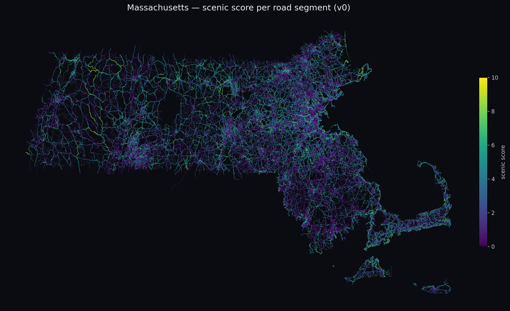

# Scenic (working title)

Scenic-route navigation: pick a destination, get a route that's beautiful instead
of fast. Massachusetts first. A scenic score is computed for every road in the
state from **open geodata only** (no Google/Apple data), a routing engine trades
travel time for beauty via a single preference knob, and a native iOS app
(SwiftUI + MapKit) is the front end on top of the routing API.



<!-- docs/ holds committed showcase images (out/ is gitignored build output;
     referencing it here would render a broken image on GitHub). Refresh with:
     sips -Z 1800 out/ma_scenic_heatmap.png --out docs/ma_scenic_heatmap.png -->


## Status

- [x] Scoring pipeline: per-road-segment "beauty vector" (water, coastline,
      forest/parks, curvature, terrain relief, farmland, viewpoints, scenic tags,
      town/urban)
- [x] Terrain relief from free Terrarium elevation tiles
- [x] Routable graph (~402k edges) split at intersections, scenic-scored
- [x] Scenic router: Dijkstra with a time-vs-scenery preference knob
- [x] Per-beauty-type preferences — weight scenery types live per request
- [x] iOS app (SwiftUI + MapKit): route planning from an address or your own
      location, tunable scenery, turn-by-turn live navigation with arrival
      time / distance remaining and a switch-to-fastest escape hatch
- [x] Scenic-byway calibration (Mohawk Trail, Jacob's Ladder)
- [x] Scoring calibrated against the score distribution, with tests that guard
      it (`tests/`) — see [How scoring works](#how-scoring-works)
- [x] Hosted API: self-hosted on a spare laptop behind a Cloudflare tunnel, so
      the app works off-device on a real phone — see
      [`server/DEPLOY.md`](server/DEPLOY.md)
- [ ] Land cover (NLCD/ESA WorldCover) feature for better score accuracy
- [x] Drive traces: every drive records itself, so a test drive produces
      measurements instead of impressions — see
      [Measuring travel times](#measuring-travel-times)
- [x] More accurate travel times: routes are priced at the speed each road class
      is really driven, plus the mapped traffic signals and stop signs on them,
      in the direction those face. Measured against two recorded drives, error
      falls from 22% to 5.7% pooled, and the ETA the app showed for one of
      them goes from 13.3% out to 2.2%. What is left is congestion, which no static graph
      predicts — see [Measuring travel times](#measuring-travel-times)
- [ ] Time of day. A static cost is an average over a quiet hour and a busy one:
      the two drives met almost the same number of signals — 26 and 27 — and
      stopped at 4 and 12 of them. That variance, not the model, is what now
      caps per-drive accuracy
- [x] Directions a driver can follow. Two measurable ways a route misleads
      someone, both now audited by `tools/audit_directions.py` over 120 random
      routes: turns OSM forbids (18% of routes → 1%, by splitting the 3,078
      junctions that carry a restriction into one node per approach), and
      junctions where holding the wheel takes you off route with no instruction
      (78% of routes → 0%). See
      [`docs/directions-accuracy.md`](docs/directions-accuracy.md)
- [ ] Lane guidance. Nothing reads `turn:lanes`, so nothing ever says "use the
      right two lanes" — and at a multi-lane exit the wrong lane is a missed
      exit however good the maneuver is
- [ ] `via`-way turn restrictions (604 in MA), where the forbidden movement
      spans a whole road rather than a junction. Needs the search to remember
      more than one junction back
- [ ] Start from the exact point, not the nearest corner. `snap()` finds the
      road you're on and then routes from that road's *nearer end* — right
      street, but a median 99 m up it (p90 217 m), because graph nodes are
      junctions. Splitting the snapped edge into two virtual nodes per request
      would take that to zero
- [x] An instrument for route quality. Two buttons on the nav screen record what
      the driver thinks of the road they are on, and `analyze_trace.py` compares
      each verdict against what the score claimed for that stretch — so "is this
      actually a nice road?" produces a number instead of an impression. See
      [Measuring whether the roads are nice](#measuring-whether-the-roads-are-nice)
- [ ] **Drive the routes and judge them.** The instrument above has never been
      pointed at a road. Nothing in the repo yet says the scenic score agrees
      with a human, because scoring is calibrated against its own distribution
      plus two byways named in `score.py` — self-consistency, not ground truth.
      This is the one open item a laptop cannot close, and now the only thing
      it needs is a drive.

> The early MapLibre web demo was retired to focus on iOS; it lives in git
> history (`git show 82044e2`) and is cheap to revive on the same API if needed.

## Architecture

```
OSM PBF ─┐
Terrarium tiles ─┼─> score.py ──> scored_chunks.parquet ─┐
                 │                                         ├─> graph.py ─> graph_*.parquet
                 │                                         │                     │
                 └─> elevation.py ─> relief.tif ──────────┘            router.py (Dijkstra)
                                                                               │
                                                          server/app.py (Flask API) ─> ios/ (SwiftUI app)
```

`pipeline/common.py` holds the constants shared across these stages (what counts
as a drivable road, the Massachusetts projection).

## Run the pipeline

```sh
python3 -m venv .venv
.venv/bin/python -m pip install -r pipeline/requirements.txt

# 1. data (free): MA OpenStreetMap extract
curl -L -o data/raw/massachusetts-latest.osm.pbf \
  https://download.geofabrik.de/north-america/us/massachusetts-latest.osm.pbf

# 2. features + score
.venv/bin/python pipeline/extract.py   data/raw/massachusetts-latest.osm.pbf data/processed
.venv/bin/python pipeline/elevation.py data/processed 11      # terrain relief raster
.venv/bin/python pipeline/landcover.py data/processed         # WorldCover tree cover
.venv/bin/python pipeline/score.py     data/processed         # scenic score per chunk
.venv/bin/python pipeline/render.py    data/processed out     # heatmap + regional maps

# 3. routable graph
.venv/bin/python pipeline/graph.py     data/raw/massachusetts-latest.osm.pbf data/processed
```

## Run the API

```sh
.venv/bin/python server/app.py        # local dev server on http://127.0.0.1:5057
```

To *host* it (spare laptop or VPS, with a production server + tunnel), see
[`server/DEPLOY.md`](server/DEPLOY.md) — that path runs `server/serve.py`.

`GET /` returns a short description of the service and its endpoints, which
doubles as a liveness check you can open in a browser.

The iOS app (`ios/`, open in Xcode) calls `GET /api/route?from=LAT,LON&to=LAT,LON&pref=0..1`
and renders the fastest vs scenic routes. It reads the backend URL from the
`ScenicAPIBaseURL` Info.plist key set in `ios/project.yml`, overridable at
runtime with a `SCENIC_API` environment variable. Command-line equivalent:

```sh
.venv/bin/python pipeline/router.py data/processed "42.2626,-71.8023" "42.3551,-71.0657" 0.6
```

## How scoring works

Each ~400 m road chunk gets component scores in `[0,1]` for proximity to water,
coastline, forest/parks, farmland and viewpoints, plus road curvature and local
terrain relief. The forest component is half OSM's mapped woods/parks and half
measured tree cover from ESA WorldCover (`landcover.py`), because OSM's polygons
record land *designation* rather than vegetation and are three times more
complete in Rhode Island than in Maine — see
[`docs/geodata-sources-findings.md`](docs/geodata-sources-findings.md). A weighted blend (tunable constants at the top of `score.py`)
produces a 0–10 composite, with penalties for highways and unpaved surfaces.
The router charges a minutes-equivalent penalty per km of *unscenic* road, so the
preference knob trades extra time for scenery.

Every constant in that blend is fitted to the *distribution* it produces, not
guessed, because a single number silently reshapes 66,000 km of road. `score.py`
prints a calibration report on each run — scale percentiles, per-component
coverage, and benchmark roads — and the current numbers are: median road 4.4,
p90 6.9, p99 9.1, with Greylock's Notch Road at 6.6 and the Mass Pike at 0.6.
Three things that report is specifically there to catch, all of which were live
at some point:

- **a component pinned at its ceiling** — curvature is measured between chords
  60 m apart rather than between raw ~20 m OSM vertices, because summing
  vertex-to-vertex heading change measures digitizing jitter (it reached 3,500
  deg/km, ten rotations per kilometre) and rated cul-de-sacs above the Mohawk
  Trail;
- **a component with no range left** — relief is scaled to Massachusetts
  terrain, not alpine, or the Hills slider has nothing to grab;
- **a compressed scale** — no real road collects every component, so the blend
  needs an explicit stretch or "8/10" is unreachable.

## Measuring travel times

Travel time was `length_m / speed_kmh`, summed over the route's edges — free
flow, with nothing charged for traffic lights, stop signs, turns or traffic,
though MA has 11,348 mapped signals and 17,567 stop signs. Measured against two
recorded drives it ran 22% short of the clock.

It is now two terms, both applied in `router.py` when the graph loads:

    time = distance ÷ (speed limit × how fast that class is really driven)
           + the controls on that road, in the direction they face

`SPEED_FACTOR` holds the first (0.95 on surface roads; motorway 1.16, because
drivers exceed the limit), `CONTROL_SECONDS` the second (9.5 s per signal met,
9.3 s per stop sign — P(stop) and the wait folded together). `graph.py` counts
the controls per edge per direction; both tables are fitted from traces by
`tools/fit_junction_cost.py`. Full workings in
[`docs/junction-timing-plan.md`](docs/junction-timing-plan.md).

The third defect was underneath both: `SPEED_KMH`, the assumed limit where OSM
has no `maxspeed` tag — 77% of the network's kilometres — was a table of
guesses. Read off the tagged roads of the same class instead, `residential` goes
from 30 km/h to 40 (25 mph, Massachusetts' statutory default; 30 is not a limit
posted anywhere in the state) across 36,871 km of road, and `trunk` from 85 to
64. That table was doing most of the damage: with it fixed, the per-class speed
factors collapse from 0.86/0.89/0.93 to 0.94/0.94/0.95 — one number, not three,
which is why one number can now cover the classes with no measurement at all.

Guessing a correction would be calibrating against Apple Maps' model — traffic
included — rather than against the road. So the app measures instead. Every
drive writes an NDJSON trace to its `Documents/traces` folder
(`ios/Sources/DriveTrace.swift`): one record per GPS fix, carrying both the raw
position and the fix's match onto the route line. That match is the measurement
— `travelled` is metres along a known route, so its slope against the timestamp
is real speed at a known place on a known road.

Getting a drive worth analysing:

- **Start where the route starts.** Fixes taken before the driver reaches the
  line are dropped — the match lands wherever the route happens to pass nearest,
  which is not where they are. Driving two miles to the route start measures
  nothing.
- **Watch the indicator.** The nav screen shows whether it is recording, next to
  the arrival time. If it says otherwise, the drive is not worth taking.
- **Expect the blue bar.** Background location is on during a drive, so a locked
  phone or a phone call doesn't end the recording. It stops when the drive does.
- **Plug in.** A 1 Hz GPS with the screen awake is not gentle on a battery, and a
  phone that dies at minute 50 takes the last of the drive with it.
- **Drive the same route twice at different hours** if you want to separate
  traffic from the road. Nothing else can: one drive cannot tell a busy junction
  from a slow one.

- **Follow the reroutes, or expect fewer of them.** A reroute now opens with the
  maneuver you have to make — "Make a U-turn on Bedford Street" — rather than a
  compass heading, because the destination is often behind you and "Head
  southeast" reads as "carry on". If you decline several in a row the app waits
  longer each time before asking again, and it stops re-planning inside the last
  300 m. All three landed after 2026-08-22, where one drive rerouted ten times
  in 160 seconds and the banner reset to its first instruction each time.

- **Start on the road, not in the driveway.** The origin snapped 165 m from the
  car on one 2026-08-22 drive, which put the route's first coordinates on a
  different street: 3.5 minutes and 1.5 km of that drive are unmeasurable, and
  nothing could re-route out of it. The app now gives up on a route you are
  driving *away* from, but the cheap fix is to pull onto the street first. Only
  the *origin* still has this problem — destinations go through the access layer
  below.

- **A destination in a car park is routed to the car park's entrance.**
  `highway=service` is not in the routing graph and never will be (433,969 of
  them against 227,251 drivable ways), but it *is* extracted into
  `access_ways.parquet` / `access_entries.parquet` purely so
  `Router.snap_destination` can turn a pin inside a lot into the road you can
  get in from. Without it, three of the five 2026-08-22 destinations snapped to
  the wrong side of the building and two to a road with no connection to the lot
  at all. The layer is optional: absent, the router silently reverts to nearest.

- **Tap the two buttons.** They are the only record of whether the route was any
  good — see [Measuring whether the roads are
  nice](#measuring-whether-the-roads-are-nice). A drive that measures the clock
  perfectly and says nothing about the scenery has tested the part that was
  already working.

Then pull the traces off through Files.app (On My iPhone → Scenic) or Finder
over a cable — do it before deleting the app, since that takes them with it:

```sh
.venv/bin/python tools/analyze_trace.py data/processed traces/*.ndjson
```

which reports, per drive and pooled across drives:

- **the headline** — actual vs. predicted minutes for the ground actually
  covered, priced per snapped edge rather than by scaling the route's total, so
  a drive that rerouted or was abandoned halfway still counts;
- **a speed factor per road class** — measured moving speed against the speed the
  graph assumed. This is what `SPEED_KMH` should be multiplied by. Classes with
  too little road behind them are marked, not quietly averaged in;
- **stops, split by what caused them** — at a mapped traffic signal, a stop sign,
  a turn, or nothing identifiable. This is the split the whole exercise turns on:
  a signal is on that road *every* time you drive it, so it belongs in `graph.py`
  and needs no traffic feed, while an unexplained stop is congestion that no
  static data will ever predict. Summing them would bake one afternoon's traffic
  into the graph permanently;
- **speed by grade band** — whether the back roads are slow because of the
  corners or because of the climb.

Four things worth knowing before reading a report.

*Parking is not junction cost.* A stationary run longer than `PARKED_S` (5 min)
is held out of both the junction cost and the clock the router is judged
against, and listed at the end of the report with its time and place so the
threshold can be overruled. This is not fussiness: on the drives of 2026-08-22
two runs, of 7 and 13 minutes, carried 57% of all measured stopped time, landed
in the "unexplained" bucket, and moved one drive's headline error from +23% to
+59%. Fitted, they would have become a permanent per-junction penalty on every
road in the state. If one of the listed runs was really the road stopping you —
a freight crossing, a drawbridge — raise the constant and re-run.

*Every exclusion is reported.* The analyzer drops fixes it can't trust, and the
dangerous failure is the silent one: a phone that stops reporting while the car
is stationary turns every stop into a gap, the junction cost reads zero, and that
looks like good news. So wall-clock time is printed next to measured time, and
unaccounted minutes next to both — with the drive's own `phase` records saying
which gaps were the app being backgrounded rather than a tunnel.

*The app is set up so a drive can't be half-lost.* `LocationManager` runs with no
distance filter (a filter can't make fixes arrive faster — GPS is ~1 Hz — it only
suppresses ones that moved too little, so the 5 m filter this used to carry
deleted the record of every car sitting still), and with `UIBackgroundModes:
location`, so a locked phone or an incoming call doesn't silently end the drive.
The nav screen shows whether it is recording, because a screen that looks normal
while recording nothing costs a whole drive.

*Grade is measured over a 200 m baseline*, on smoothed altitude, and reported
only in coarse bands. Rise over a single 20 m step is almost entirely phone-GPS
noise, and read that way a dead-flat drive splits neatly into confident-looking
uphill and downhill — the curvature mistake exactly. There is a test for it.

Applying the correction was a bigger change than it looks, and this warning
turned out to be the right one: `minutes` is the Dijkstra weight, not a display
field, so making time more expensive divides through as a *smaller effective*
`BETA`. Measured after the fact, the pref slider's bottom half had gone soft —
a pref-0.25 route found scenery of 3.39 where it used to find 4.62 — and `BETA`
had to rise from 7.0 to 10.0 to mean the same thing to a driver. The top half
was untouched, because the scenery penalty saturates up there.

The re-ranking prediction was half right. Per-class factors do re-rank, but not
toward arterials: arterials carry 123 traffic signals per 100 km against a
motorway's 0.9, so the correction makes *them* the expensive option. What it
rewards is motorway. Across 40–90 km trips the fastest route got 4% faster while
the max-scenic one got 15% slower, so the honest gap between them widened from
44% to 71% rather than narrowing.

## Measuring whether the roads are nice

Everything above measures the car. None of it measures the product.

The scenic score is calibrated against its own distribution and against two
byways whose names are written into `score.py`. That establishes it is
self-consistent and correctly scaled; it does not establish that it is right.
No open geodata answers "is this road beautiful", and the person driving it is
the only instrument that can — while they are there, because the answer does not
survive the trip home.

So the nav screen carries two buttons, above the trip bar: **lovely road** and
**nothing to see**. One tap each, distinct haptics so you can feel which one you
hit without looking, and a `mark` record in the trace. Two options rather than a
five-point scale because this is answered at 45 mph — a scale needs aiming, and
aiming needs looking at the phone. The calibration wants a rank statistic over
many marks anyway, so precision on any single one buys nothing.

`analyze_trace.py` then resolves each verdict to a stretch of road and compares
it against what the score claimed there:

    SEPARATION  0.83    above chance
    0.50 is a coin — but with 24 nice and 19 dull, a score
    that knows nothing still reaches 0.64 one run in twenty.

That is the whole exercise in one number: the chance the score ranks a road you
liked above one you didn't. Three things about it are load-bearing.

**It is a rank statistic, not a difference of means.** It assumes only that
higher should mean nicer, which is the entire claim the score makes, and one
marked stretch that happened to snap to a 9.6 cannot carry it.

**The noise floor is printed beside it, computed from your own sample sizes.**
Off five marks each way a score that knows nothing reaches 0.82, so an
impressive-looking 0.75 from a first drive is worth nothing — and read against
0.50 it looks like the premise confirmed. That is much the likeliest way this
exercise talks itself into a wrong answer, so the number it has to beat is
always on screen next to it.

**A mark is about a stretch, and a late one.** A driver taps *after* seeing
something, so the tap is downstream of what prompted it; the anchor is walked
back by the distance covered during `MARK_REACTION_S`, converted at the speed the
car was doing rather than at a guessed number of metres — three seconds is 40 m
through a village and 110 m on a highway. From there the verdict is charged to the
preceding `MARK_WINDOW_M` (400 m, one `score.py` chunk's worth of road, sampled
along the route line rather than per GPS fix so a minute at a red light doesn't
weight that junction sixty times over). Because the window is a judgement call,
the report re-runs its own headline at 200 m and 800 m and says so if the answer
moves — a conclusion that only holds at one window size is not one.

Two things worth knowing before reading a report:

- **Every exclusion is counted, and "you didn't tap" is never confused with "your
  taps were unusable."** They call for opposite responses. A mark carries the
  *last* GPS fix, not the instant of the tap, so a stalled location stream
  produces verdicts anchored wherever the car was when it stopped reporting —
  dropped past 5 s of staleness, and reported as that rather than blamed on the
  road. The marks stay in the trace either way: fix the cause and re-read, no
  re-driving.
- **The report ends with the disagreements, worst few in each direction**, with
  road names and coordinates, because those are the addresses worth going back
  to. The two directions cost different things. A road you called dull that
  scored high is scenery the model claims and the road doesn't have — the
  expensive kind, since that claim is what the router spends your extra minutes
  buying. A road you liked that scored low costs nothing but is where the score
  is blind, and it will route around it.

Tap often; there is no cost to it, and the noise floor falls as the marks
accumulate. Two drives at different hours are still worth more than one — but for
this, unlike for the clock, a second driver would be worth more than either.

## Tests

```sh
.venv/bin/python -m pytest tests/          # backend: 214 tests
```

The geometry and scoring maths run anywhere; the calibration, routing and API
tests need a built graph and skip cleanly without one. Point them at a graph
elsewhere with `SCENIC_DATA=/path/to/processed`.

The iOS app has its own suite for the parts a simulator can't exercise and a
drive only tests once — where the driver is on the route, when a maneuver has
been passed, when the trip has actually ended, which of two overlapping reroutes
wins, and that a tapped scenery verdict reaches the disk with the position and
staleness the analysis needs to place it:

```sh
cd ios && xcodegen generate && xcodebuild test -project Scenic.xcodeproj -scheme Scenic -destination 'platform=iOS Simulator,name=iPhone 17 Pro'
```

## Where the next features plug in

The component pipeline is deliberately open-ended: `score.py` writes every
`c_<component>` column it computes, `graph.py` auto-detects those columns and
carries them onto edges, and `router.py` re-blends them live per request. So:

- **A new scenery signal** (e.g. land cover from NLCD/ESA WorldCover) is one new
  `c_...` column plus a `WEIGHTS` entry in `score.py`, then a score + graph
  rebuild. Add it to `BEAUTY_TYPES` in `router.py` only if users should be able
  to tune it (otherwise list it in `BASELINE`).
- **Retuning travel time** is `SPEED_FACTOR` and `CONTROL_SECONDS` in
  `router.py` — constants and a restart, deliberately not a graph rebuild, so
  re-fitting them as drives accumulate costs nothing. Drive first and fit them
  to the trace with `tools/fit_junction_cost.py` rather than picking numbers.
  This section used to warn against charging a junction penalty *per edge*,
  because edges are also split where a way merely ends and a flat per-edge cost
  would price OSM's editing history instead of the road — the same trap
  curvature fell into. The warning stands; what dodges it is that the cost is
  per *control node found in the way's node list*, so a split with no signal on
  it costs nothing. Do not replace that with a per-edge or a nearest-edge
  charge: 81.7% of MA's controls have more than one road within 15 m of them.
- **Retuning the scenery blend against real verdicts** is `WEIGHTS` in
  `score.py`, then a score + graph rebuild. Drive first: the marks are what say
  which component is lying, and the disagreement table names the roads to check.
  Read the separation number against the noise floor printed beside it, never
  against 0.50 — and change one weight at a time, since `score.py`'s calibration
  report is what catches a component pinned at its ceiling.
- **A second region** is the same pipeline run on another Geofabrik extract.
  The MA-specific bits to generalize: the projection in `common.py`, the BBOX
  in `elevation.py`, the byway names in `score.py`, and the
  `Region.massachusetts` search bias in the iOS app.

The user-facing scenery labels live in one place per language: `SCENERY_BREAKDOWN`
in `router.py` (server) and `RouteProps.sceneryBreakdown` in `Models.swift`
(client), with the tunable type names in `BEAUTY_TYPES` and `BeautyType.all`.
Both suites assert the same lists from their own side, so renaming a type on one
end fails a test rather than quietly dropping a bar from the app.
